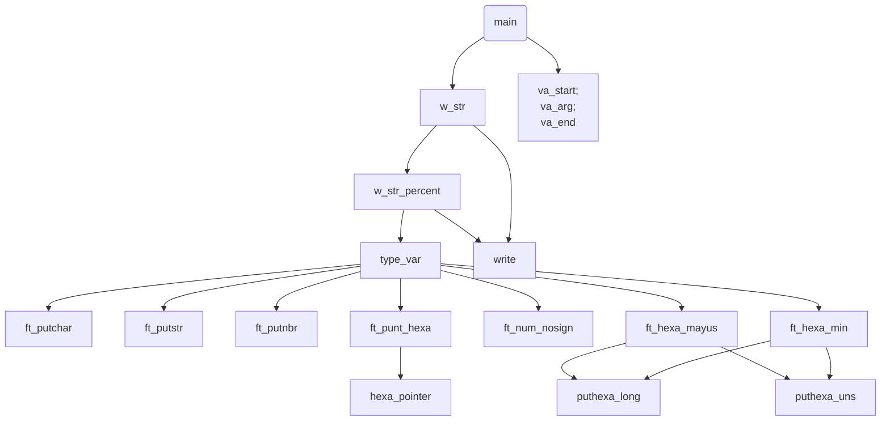

<h1 align="center"> # 42 Common Core Curriculum / Circle 1 / #PrintF </h1>
<p align="center"></p>

> 
<p align="center">
	<a href="#1.RESOURCES">1.RESOURCES</a> •
	<a href="#REFERENCE">REFERENCE</a> •
	<a href="#RESOURCES">RESOURCES</a> •
	<a href="#BACKLOG%%DESIGNING">BACKLOG DESIGNING</a> •
	<a href="#3.CODE">3.CODE</a> •
	<a href="#4.TESTER">4.TESTER</a> •
  <a href="#5.DOCUMENTATION">5.DOCUMENTATION</a> •
  <a href="#6.EXAM">6.EXAM</a> •
</p>
<br>

<br>

<br>

<br>

<br>

<br>


# INSTRUCTIONS
This project involved recreating the well-known C library function, printf. This provided a valuable learning opportunity in variadic arguments and structures, particularly if we intend to incorporate additional flags into our implementation of print.

- [Subject](https://github.com/dnepomuc/ft_printf/blob/master/subject/en_subject_ft_printf.pdf) `PDF`
- [References](https://github.com/dnepomuc/42-resources#01-ft_printf) `GitHub`
<br>

<br>

<br>

<br>

<br>

<br>


## BACKLOG


# TESTER


<br>

<br>

<br>

<br>

<br>

<br>


# DOCUMENTATION
- [ ] Manage any combination of the following flags: `-O` and the field minimum width under all conversions;
- [ ] Manage all the following flags: `#` ` ` `+`;

# STRUCTURE

 ft_printf (main)  
 ├── w_str  
 │...├── w_str_percent  
 │...│...├── type_var  
 │...│...│...├── ft_putchar (standard library)  
 │...│...│...├── ft_putstr (standard library)  
 │...│...│...├── ft_putnbr (standard library)  
 │...│...│...├── ft_punt_hexa  
 │...│...│...│...└── hexa_pointer  
 │...│...│...├── ft_num_nosign  
 │...│...│...├── ft_hexa_mayus  
 │...│...│...│  ├── puthexa_long  
 │...│...│...│...└── puthexa_uns  
 │...│...│...└── ft_hexa_min  
 │...│...│.......├── puthexa_long  
 │...│...│.......└── puthexa_uns  
 │...│...└── write (standard library)  
 │...└── write (standard library)  
 └── va_start, va_arg, va_end (standard library)  




### [ft_printf](/ft_printf.c) 
`ft_printf`es una función que formatea e imprime la salida en stdout (típicamente la terminal). Toma una cadena de formato, que especifica cómo se debe formatear la salida, y un número variable de argumentos que contienen los valores que se imprimirán.

La función comienza inicializando una lista de argumentos variables usando `va_start`. Luego itera a través de la cadena de formato, carácter por carácter. Cuando encuentra un carácter `'%'`, llama a la función de conversión con el siguiente carácter en la cadena de formato y el argumento actual de la lista de argumentos. La función de conversión procesa el argumento y lo formatea de acuerdo con el especificador de conversión correspondiente (el carácter después del '%'). Si el carácter no es un `'%'`, se llama a `ft_putchar` para imprimir el carácter. Finalmente, la función devuelve el número total de caracteres impresos.

### va-list
En C, `va_list` es un tipo que contiene una lista de argumentos de distintos tipos, junto con un estado actual que apunta al siguiente argumento de la lista. Se utiliza para pasar un número variable de argumentos a una función.

Para usar `va_list` en una función, primero debe declararla e inicializarla usando `va_start`. Luego puede usar `va_arg` para recuperar el siguiente argumento de la lista y `va_end` para limpiar y restablecer la lista cuando haya terminado de procesar los argumentos.

### va_arg
`va_arg` es una macro en C que recupera el siguiente argumento en una `va_list`. Toma una variable `va_list` y el tipo del argumento como argumentos, y devuelve el argumento como el tipo especificado.

La macro `va_arg` generalmente se usa dentro de un ciclo para iterar a través de todos los argumentos en una `va_list`. La primera vez que se llama a `va_arg` en una `va_list`, devuelve el primer argumento; la segunda vez que se llama, devuelve el segundo argumento; etcétera.

### va_start
`va_start` es una macro en C que inicializa una variable `va_list` para usar con `va_arg` y `va_end`. Toma como argumentos una variable `va_list` y el nombre del último parámetro fijo en la función.

La variable `va_list` se usa para contener una lista de argumentos de diferentes tipos pasados a una función. Se debe llamar a `va_start` antes de que se pueda usar `va_arg` para recuperar los argumentos de la lista.

### va_end
`va_end` es una macro en C que limpia y restablece una variable `va_list` después de haberla usado con `va_arg`. Toma una variable `va_list` como argumento.

La variable `va_list` se usa para contener una lista de argumentos de diferentes tipos pasados a una función. Una vez que haya terminado de procesar los argumentos, debe llamar a `va_end` para limpiar y restablecer la variable `va_list`. Esto normalmente se hace antes de regresar de la función.

### converter

El [convertidor](/ft_printf.c) es una función que procesa un solo argumento en una `va_list` y lo formatea de acuerdo con el especificador de formato dado. Toma un `char` que representa el especificador de formato y una `va_list` como argumentos, y devuelve un `int` que indica el número de caracteres impresos.

La función primero verifica el valor del parámetro de formato y llama a la función adecuada para procesar el argumento. Por ejemplo, si el formato es `'c'`, la función llama a `ft_putchar` para imprimir un solo carácter de `va_list`. Si el formato es `'s'`, la función llama a `ft_putstr` para imprimir una cadena terminada en nulo. Si el formato es `'p'`, la función llama a `ft_print_ptr` para imprimir un valor de puntero.

Cada una de las funciones llamadas por el convertidor toma un solo argumento de `va_list` usando la macro `va_arg`. El tipo de argumento pasado a `va_arg` debe coincidir con el tipo de argumento esperado por la función. Por ejemplo, si el especificador de formato es `'d'` o `'i'`, la función llama a `ft_putnbr` para imprimir un valor `int`, por lo que se llama a `va_arg` con `int` como segundo argumento.

Una vez que el argumento ha sido procesado e impreso, el convertidor devuelve el número de caracteres impresos. Si no se reconoce el parámetro de formato, la función devuelve 1.


### ¿Que es `uintptr_t`?
`uintptr_t` es un tipo entero sin signo definido en el encabezado `stdint.h`. Está diseñado específicamente para contener un valor de puntero y se garantiza que sea lo suficientemente grande como para contener cualquier puntero válido en el sistema host.

El tipo `uintptr_t` se define como un tipo entero sin signo con el mismo tamaño que un puntero. En un sistema de 32 bits, normalmente se define como un alias para `unsigned int`, mientras que en un sistema de 64 bits normalmente se define como un alias para `unsigned long long`.

### ¿Por que pasamos como argumento la cadena "0123456789abcdef"?
`0123456789abcdef` es una cadena que especifica el orden en que se deben imprimir los dígitos de un número hexadecimal.
Cuando llame a `ft_print_hex` con esta cadena como segundo argumento, la función imprimirá el valor entero sin signo dado como un número hexadecimal usando los dígitos `'0'` a `'f'` en el orden especificado por la cadena.

Por ejemplo, si el valor pasado a `ft_print_hex` es `10` (decimal), la función imprimirá `'a'` porque `'a'` es el sexto carácter de la cadena y `10` (decimal) es el sexto dígito en el sistema numérico hexadecimal.

Esta cadena se utiliza para especificar que los dígitos hexadecimales deben imprimirse en minúsculas. Si quisiera imprimir los dígitos hexadecimales en mayúsculas, podría usar la cadena `"0123456789ABCDEF"` en su lugar.

### [ft_print_hex](/ft_print_hex.c) 

`ft_print_hex` es una función que imprime un valor entero sin signo como un número hexadecimal. Toma un valor `int` sin signo y una cadena de dígitos hexadecimales como argumentos y devuelve un `int` que indica el número de caracteres impresos.

La función actua convirtiendo primero el valor entero sin signo a su representación hexadecimal. Para hacer esto, usa el operador de módulo (%) y la división de enteros (/) para aislar el dígito menos significativo del valor, lo agrega a una matriz de dígitos y luego divide el valor por 16. Este proceso se repite hasta que el el valor se convierte en 0.

Por ejemplo, si el valor pasado a la función es `10` (decimal), la matriz `nr_base` contendrá los dígitos [10] (decimal) después de la primera iteración del bucle.

Una vez que el valor se ha convertido a su representación hexadecimal, la función itera sobre la matriz de dígitos en orden inverso e imprime cada dígito usando la función `ft_putchar`. El parámetro base se utiliza para especificar el orden en que se deben imprimir los dígitos hexadecimales.

Si el valor pasado a la función es `0`, la función imprime un solo carácter `'0'` y devuelve 1. De lo contrario, devuelve el número de caracteres impresos.

La función itera sobre la matriz de dígitos en orden inverso porque la representación hexadecimal de un número entero se imprime con el dígito más significativo primero y el dígito menos significativo al final.

Por ejemplo, el entero decimal `123` se representa como `0x7b` en hexadecimal. Para imprimir este valor, la función necesita imprimir los dígitos `'7'` y `'b'` en ese orden.

Para lograr esto, la función primero convierte el número entero a su representación hexadecimal aislando el dígito menos significativo y agregándolo a la matriz `nr_base`. Este proceso se repite hasta que el valor se convierte en 0.

Una vez que el valor se ha convertido a su representación hexadecimal, la función itera sobre la matriz `nr_base` en orden inverso e imprime cada dígito usando la función `ft_putchar`. Esto asegura que los dígitos se impriman en el orden correcto, con el dígito más significativo primero y el dígito menos significativo al final.

### [ft_print_ptr](/ft_print_ptr.c) 

Función para imprimir un puntero (uintptr_t) en formato hexadecimal. 
`ft_print_ptr` es la función principal para imprimir un puntero. Escribe la cadena `"0x"` en stdout para indicar que el siguiente valor es un número hexadecimal. Si el valor del puntero es cero, escribe un único carácter `'0'` en la salida estándar. De lo contrario, llama a `ft_put_ptr` para imprimir la representación hexadecimal del puntero y devuelve la cantidad de caracteres escritos, que es igual a la cantidad de dígitos en la representación hexadecimal más 2 para el prefijo `"0x"`.

`ft_ptr_len` calcula el número de dígitos necesarios para representar el puntero en hexadecimal. Lo hace dividiendo el valor del puntero por 16 (que es la base del sistema numérico hexadecimal) repetidamente hasta que el cociente sea cero.

`ft_put_ptr` imprime recursivamente la representación hexadecimal del valor del puntero. Lo hace dividiendo el valor del puntero por 16 e imprimiendo el resto, luego continúa con el cociente hasta que alcanza un valor inferior a 16. Para valores inferiores a 10, imprime el carácter ASCII correspondiente al dígito (por ejemplo, '0' para 0, '1' por 1, etc.), y para valores superiores a 9 imprime el carácter ASCII correspondiente al dígito hexadecimal (ej. 'a' por 10, 'b' por 11, etc.).

## [ft_print_unsigned](/ft_print_unsigned.c) 

Esta función es una implementación personalizada de printf en el lenguaje de programación C, específicamente para imprimir un número entero sin signo (int sin signo) en formato decimal.

La función usa la recursividad para imprimir la representación decimal del valor entero. Lo hace dividiendo el valor por 10 e imprimiendo el resto, luego continúa con el cociente hasta que llega a un valor inferior a 10. Para cada división, la función incrementa un contador `n` en 1. Finalmente, la función devuelve el valor de `n`, que es igual al número de dígitos en la representación decimal del entero.

Por ejemplo, si se llama a la función con el valor `123`, primero imprimirá `3`, luego `2`, luego `1` y devolverá `3`. La salida a stdout será `"123"`.

## [ft_putnbr](/ft_putnbr.c)

`ft_putnbr` es una función que escribe un valor entero en stdout como una cadena de dígitos en formato decimal.

La función toma un solo argumento:

- `int n`: el valor entero a escribir.

La función primero verifica si el valor es igual a `-2147483648`, que es el valor mínimo que se puede almacenar en un tipo `int` de 32 bits. Si el valor es igual a este caso especial, la función escribe la cadena `"-2147483648"` en stdout y devuelve `11`, que es el número de caracteres escritos.

Si el valor no es igual a este caso especial, la función comprueba si el valor es negativo. Si es así, la función escribe un signo menos en stdout y establece `i` en 1 (para contar el signo menos como 1 carácter escrito). Luego niega el valor de `n` y almacena el resultado en una nueva variable `i` de tipo `int` sin signo. Esto se hace porque el resto de la función espera que el valor no sea negativo y el tipo `int` sin signo no puede representar valores negativos.

A continuación, la función comprueba si el valor es mayor que `9`. Si lo es, la función recursivamente se llama a sí misma con el valor `n/10` (que es el cociente de n dividido por 10). Esto continúa hasta que el valor es inferior a `10`, momento en el que la función escribe el valor en stdout como un solo dígito.

Finalmente, la función devuelve el número total de caracteres escritos, que es igual al número de dígitos en la representación decimal del valor entero más el signo menos si el valor fuera negativo.


## [ft_putstr](/ft_putstr.c)

`ft_putstr` es una función que escribe una cadena en stdout.

La función toma un solo argumento:

-`char *str`: un puntero a la cadena terminada en nulo para escribir.

La función primero comprueba si `str` es un puntero nulo. Si es así, la función establece `str` en la cadena `"(null)". Esto se hace para evitar que la función se bloquee si se pasa un puntero nulo como argumento.

A continuación, la función calcula la longitud de la cadena llamando a `ft_strlen` y pasándole `str`. `ft_strlen` es una función personalizada que devuelve el número de caracteres en una cadena terminada en nulo, sin incluir el terminador nulo.

Finalmente, la función escribe la cadena en stdout llamando a la función de escritura y pasándole el descriptor de archivo 1 (para stdout), un puntero a la cadena y la longitud de la cadena. La función de escritura es una función de biblioteca C estándar que escribe datos en un archivo u otro flujo de salida.

La función devuelve el número de caracteres escritos, que es igual a la longitud de la cadena.

### Links utiles
[Funciones variádicas](https://trucosinformaticos.wordpress.com/2018/11/25/funciones-variadicas/) <br>
[Variadic arguments](https://en.cppreference.com/w/c/language/variadic) <br>
[Variadic functions](https://en.cppreference.com/w/c/variadic) <br>


## STUDY
**ft_printf:**

* **Variadic Functions:**
    * `va_start(ap, last)`: Initializes a `va_list` for accessing variable arguments.
    * `va_arg(ap, type)`: Retrieves the next argument of a specified type.
    * `va_end(ap)`: Cleans up the `va_list` when finished.
* **Format Specifiers:**
    * `%c`, `%s`, `%d`, `%i`, `%u`, `%x`, `%X`, `%p`, `%%`, etc.: Used to format different types of data (characters, strings, integers, unsigned integers, hexadecimal numbers, pointers, etc.).
* **String Manipulation:**
    * `ft_strlen`, `ft_strchr`, `ft_memcpy`, etc.: Functions from `libft` for working with strings.
* **Integer to String Conversion:**
    * Custom functions to convert integers to strings (e.g., `ft_itoa` or equivalent in `libft`).

**General C Syntax:**

* **Pointers:** Understanding how to use pointers is crucial for all these projects.
* **Data Types:** Working with different data types (int, char, char*, etc.).
* **Conditional Statements (if, else):** Used for decision-making and branching.
* **Loops (while, for):** Used for repeated actions.
* **Functions:** Defining and calling functions to organize your code.
* **Structures:** For organizing data (more relevant in later circles).
* **Bitwise Operators:** Useful for working with flags and permissions in some cases.


## EVALUATION


## ABOUT
This project involved recreating the well-known C library function, printf. This provided a valuable learning opportunity in variadic arguments and structures, particularly if we intend to incorporate additional flags into our implementation of print.

- [Subject](https://github.com/dnepomuc/ft_printf/blob/master/subject/en_subject_ft_printf.pdf) `PDF`
- [References](https://github.com/dnepomuc/42-resources#01-ft_printf) `GitHub`

## HOW TO USE
#### 1º - Clone the repository
```git
git clone git@github.com:dnepomuc/ft_printf.git
```

#### 2º - Enter the project folder and run `make`
```bash
cd ft_printf/ft_printf
make
```

#### 3º - To use in your code, include the header
```c
#include "ft_printf.h"
```

#### MAKEFILE RULES

`make` or `make all` - Compile ft_printf files.

`make clean` - Delete all .o (object files) files.

`make fclean` - Delete all .o (object files) and .a (executable) files.

`make re` - Use rules `fclean` + `all`.

## MANDATORY
> This ft_printf function supports several format specifiers, described below:
- [x] `%c` - Print a single character;
- [x] `%s` - Print a string;
- [x] `%p` - Print void * pointer argument in hexadecimal format;
- [x] `%d` - Print a decimal (base 10) number;
- [x] `%i` - Print an integer in base 10;
- [x] `%u` - Prints an unsigned decimal (base 10) number;
- [x] `%x` - Print a number in hexadecimal (base 16) lowercase format;
- [x] `%X` - Print a number in hexadecimal (base 16) uppercase format;
- [x] `%%` - Print a percentage sign;

## BONUS
- [ ] Manage any combination of the following flags: `-O` and the field minimum width under all conversions;
- [ ] Manage all the following flags: `#` ` ` `+`;

## NORMINETTE
> At 42 School, it is expected that almost every project is written following the Norm, which is the coding standard of the school.

```
- No for, do...while, switch, case, goto, ternary operators, or variable-length arrays allowed;
- Each function must be a maximum of 25 lines, not counting the function's curly brackets;
- Each line must be at most 80 columns wide, with comments included;
- A function can take 4 named parameters maximum;
- No assigns and declarations in the same line (unless static);
- You can't declare more than 5 variables per function;
- ...
```

* [42 Norms](https://github.com/42School/norminette/blob/master/pdf/en.norm.pdf) - Information about 42 code norms. `PDF`
* [Norminette](https://github.com/42School/norminette) - Tool to respect the code norm, made by 42. `GitHub`
* [42 Header](https://github.com/42Paris/42header) - 42 header for Vim. `GitHub`


**ft_printf:**

* **Variadic Functions:**
    * `va_start(ap, last)`: Initializes a `va_list` for accessing variable arguments.
    * `va_arg(ap, type)`: Retrieves the next argument of a specified type.
    * `va_end(ap)`: Cleans up the `va_list` when finished.
* **Format Specifiers:**
    * `%c`, `%s`, `%d`, `%i`, `%u`, `%x`, `%X`, `%p`, `%%`, etc.: Used to format different types of data (characters, strings, integers, unsigned integers, hexadecimal numbers, pointers, etc.).
* **String Manipulation:**
    * `ft_strlen`, `ft_strchr`, `ft_memcpy`, etc.: Functions from `libft` for working with strings.
* **Integer to String Conversion:**
    * Custom functions to convert integers to strings (e.g., `ft_itoa` or equivalent in `libft`).

