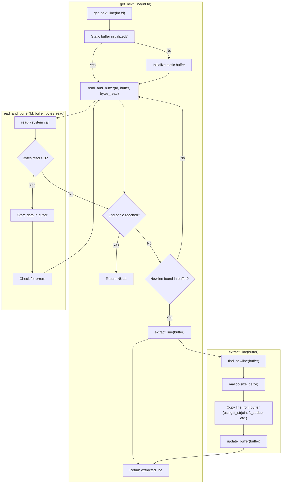

# Functions
**High-Level Function**
- `get_next_line(int fd)`: This is the primary function that will be called to read a line from a file descriptor.  

**Mid-Level Functions**
- `read_and_buffer(int fd, char **buffer, int *bytes_read)`: This function handles reading data from the file descriptor into a buffer and managing the number of bytes read.
- `find_newline(char *buffer)`: This function searches for the newline character (`\n`) within the buffer.
- `extract_line(char **buffer)`: This function extracts the complete line from the buffer, up to the newline character or the end of the buffer.
- `update_buffer(char **buffer)`: This function updates the buffer to remove the extracted line and keep any remaining data for the next read.

**Low-Level Functions**
- `ft_strchr(const char *s, int c)`: This function locates the first occurrence of a character in a string. 
- Other string utility functions like `ft_strjoin`, `ft_strdup`... 
- `malloc(size_t size)`: Dynamically allocates memory for the line and buffer.  
- `free(void *ptr)`: Releases allocated memory to avoid memory leaks.

# Flowchart
