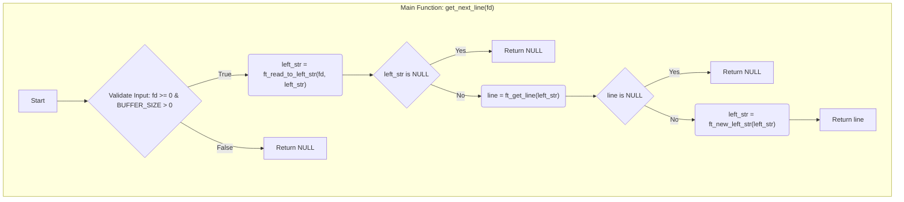
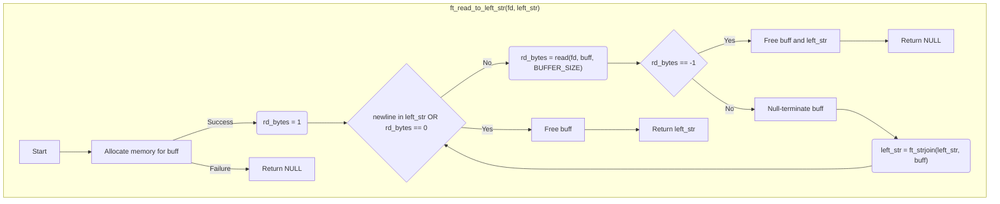
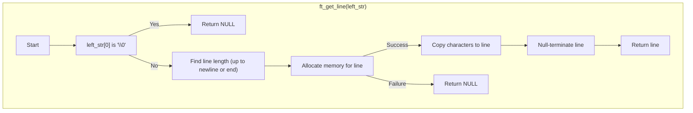
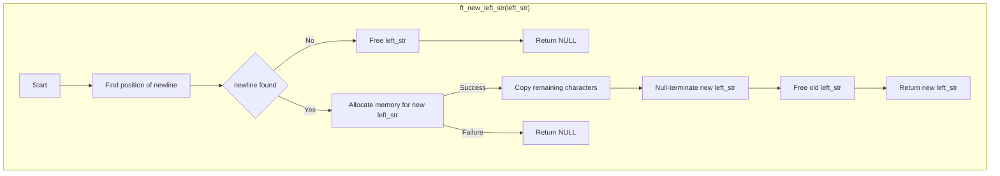

<h1 align="center">DOCUMENTATION</h1>

 
 
 

# 1. ASCII map in a nested list format

get_next_line (main)  
├── ft_read_to_left_str   
│.....├── read   
│.....├── ft_strchr  
│.....└── ft_strjoin  
├── ft_get_line  
│.....├── ft_strlen  
│.....└── malloc   
└── ft_new_left_str  
........├── ft_strlen  
........└── malloc   

# 2. FlowChart

**Main Function: `get_next_line(fd)`**

1. **Validate Input:**
   - Check if `fd` is valid (non-negative) and `BUFFER_SIZE` is positive.
   - If invalid, return `NULL`.

2. **Read and Accumulate Data:**
   - Call `ft_read_to_left_str(fd, left_str)`
     - If `left_str` doesn't contain a newline:
       - Read up to `BUFFER_SIZE` bytes from `fd` into `buff`.
       - If read fails, free `buff` and `left_str`, return `NULL`.
       - Append `buff` to `left_str` using `ft_strjoin`.
       - Repeat until a newline is found in `left_str` or end-of-file is reached.
     - Free `buff`.

3. **Extract Line:**
   - Call `ft_get_line(left_str)`:
     - Find the first newline or end of string in `left_str`.
     - Allocate memory for `line` and copy characters up to the newline (or the whole string if no newline).
     - Null-terminate `line`.

4. **Update Leftover Data:**
   - Call `ft_new_left_str(left_str)`:
     - Find the position of the newline in `left_str`.
     - If no newline (end of file), free `left_str` and return `NULL`.
     - Allocate memory for a new `left_str` to store the remaining characters after the newline.
     - Copy the remaining characters to the new `left_str`.
     - Free the old `left_str`.

5. **Return Line:**
   - Return the extracted `line`.

**Helper Functions:**

* `ft_strlen(s)`: Calculates the length of a string `s`.
* `ft_strchr(s, c)`: Finds the first occurrence of character `c` in string `s`.
* `ft_strjoin(left_str, buff)`: Concatenates `left_str` and `buff` into a new string, freeing `left_str`.
* `ft_get_line(left_str)`: Extracts a line (up to newline) from `left_str` and returns it as a new string.
* `ft_new_left_str(left_str)`: Updates `left_str` to contain the remaining characters after the extracted line.

**Key Points:**

* `left_str` is a static variable, maintaining its value across multiple calls to `get_next_line`.
* `ft_read_to_left_str` reads from the file and stores data in `left_str` until a newline or EOF.
* `ft_get_line` extracts a complete line from `left_str`.
* `ft_new_left_str` prepares `left_str` for the next call by removing the extracted line.

Remember: This representation assumes a basic understanding of C and linked list concepts. 

 
 
 

### Mermaid.JS

# 3. Code Commented

 
 
 

# 4. Manual

 
 
 

