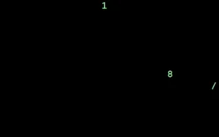
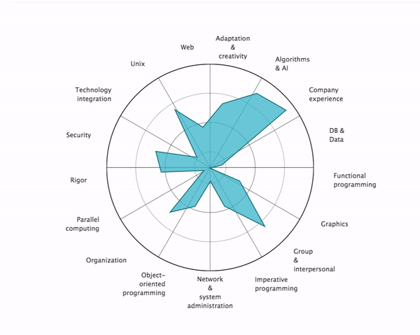

 L'eco 42L'ecole 42L'ecole 42L'ecole 42L'eco  
---
--- 


---     


- # : The Code Odyssey 🚀
    Welcome to my 42 journey! This ain't your average school. We're diving deep into code, collaboration, and peer-driven learning.
  - ### About 42: Where the Wild Things Code 🌐
    42 is a global network of tuition-free coding schools.  Think of it as a coding bootcamp on steroids – intense, hands-on, and focused on real-world skills. There are no teachers, no lectures... just you, your peers, and a mountain of challenges.Learn more on the official [42 website](https://42.fr/en).
  - ### The Piscine: Sink or Swim 🏊‍♀️
     Admission starts with the "Piscine" (French for swimming pool). It's a month-long coding immersion experience designed to test your grit, problem-solving, and ability to learn independently.  It's tough, but those who make it through emerge as resilient coders.


---


---
- ## The  Curriculum: Your Code Adventure 🗺️ - 
  Once you've survived the Piscine, the real adventure begins! The curriculum is split into phases:

- ### Common Core: 18 Months 🏗️
  This is where you build your foundation with C and C++, tackling projects that cover:  
  Skills:
  - **Algorithms & Data Structures**: The building blocks of efficient code.
  - **Unix & Systems Programming**: Understanding the inner workings of your computer.
  - **Imperative Programming (C)**: The language that gets you close to the metal.
  - **Object-Oriented Programming (C++)**: A powerful paradigm for complex systems.
  - **Networking & Web Development:**  From sockets to building web apps.
  - **Databases & Graphical Programming:** Storing and visualizing data.  

  Projects:  
  - `Reloaded`
  - `Libft`  
  - `get_next_line / Born2BeRoot / ft_printf`
  - `push_swap / pipex_or_minitalk / fdf_or_so_long_or_fract-ol`
  - `Libft`
  - `Minishell / Philosophers`
  - `get_next_line / Born2BeRoot / ft_printf`
  - `CPP00-04 / Cub3D_or_MiniRT / NetPractice`
  - `Minishell(pipex_or_minitalk) / Philosophers`
  - `CPP05-09 / Webserv_or_IRC / Inception`
  - `CPP00-04 / Cub3D_or_MiniRT / NetPractice`
  - `Transcendence`
  - `CPP05-09 / Webserv_or_IRC / Inception`  

  
>Skills to be developed.

  
- ### Professional Experience: 4-6 Months 💼
  A internship that solidifies your skills and builds your network.

- ### Specialization: 18 Months 🎯
  Choose a path to become a master in one of these areas:
  -**Operating Systems**
  - **Artificial Intelligence**
  - **Cybersecurity**
  - **Game Development**
  - **Graphical Programming**
  - **Web and Mobile Development**


- ### Final Internship: 6 Months 🚀
  Launch your career with a final internship that solidifies your skills and builds your network.

---


Let's code!

```C
#include "libft.h"
char	*ft_strdup(const char *s1)
{
	char	*str;
	size_t	len;

	len = ft_strlen(s1) + 1;
	str = (char *)malloc(sizeof(char) * len);
	if (str == NULL)
		return (NULL);
	ft_strlcpy(str, s1, len);
	return (str);
}
```

```C
#include <stdio.h>
#include "libft.h"   

int main() {
    // Test Cases
    char *original_str1 = "Hello, world!";
    char *original_str2 = ""; 
    char *original_str3 = NULL; 

    // Duplicate Strings
    char *dup_str1 = ft_strdup(original_str1);
    char *dup_str2 = ft_strdup(original_str2);
    char *dup_str3 = ft_strdup(original_str3);

    // Test and Print Results
    if (dup_str1 != NULL) {
        printf("Original: %s\n", original_str1);
        printf("Duplicate: %s\n", dup_str1);
        // Verify the contents - manually check if strings are equal
        if (ft_strcmp(dup_str1, original_str1) == 0) { // Assuming ft_strcmp is part of libft
            printf("Test 1 Passed: Duplicated strings match.\n");
        } else {
            printf("Test 1 Failed: Duplicated strings do not match.\n");
        }
        free(dup_str1); 
    } else {
        printf("Test 1 Failed: Memory allocation failed for dup_str1.\n");
    }

    // Similar tests for dup_str2 and dup_str3

    return 0;
```


---
# Table of Content
```
L'ecole42/
├── What
│   ├── really
│   │   └── no way
│   ├── this?
│   │   └── ...
│   └── with this?
│       └── ...
├── Where?
│   ├── this place
│   ├── this things
│   ├── oooh
│   │   └── in it?
│   └── ok
└── Why?
    ├── make sense?
    └── why not?
```

